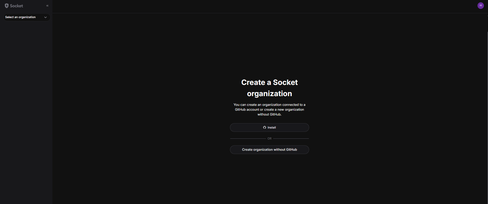
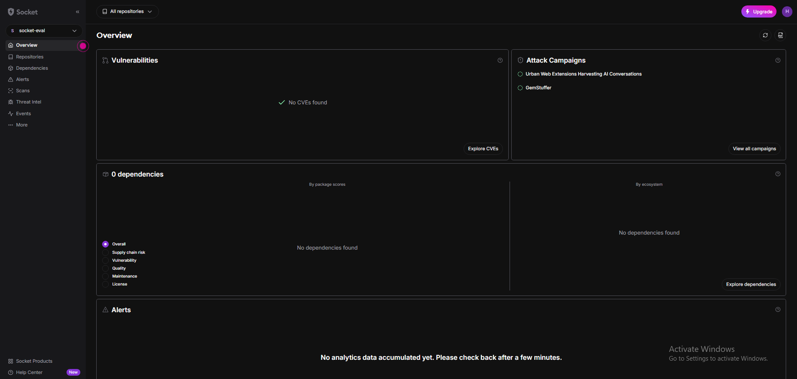
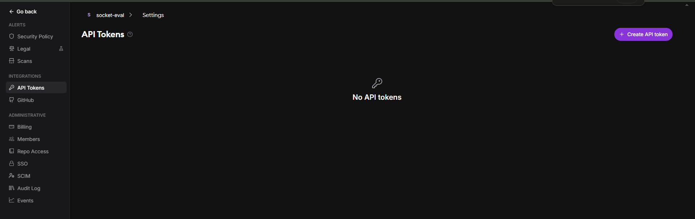
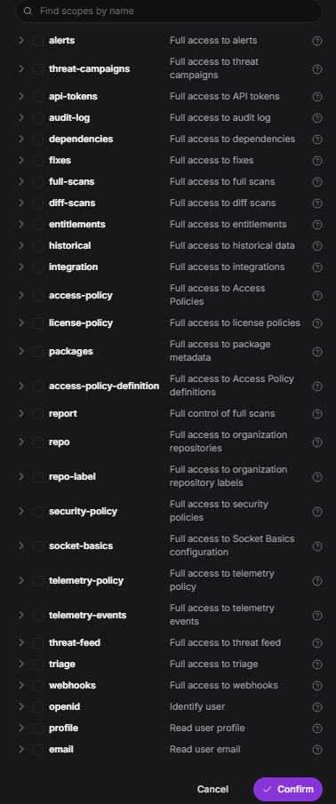
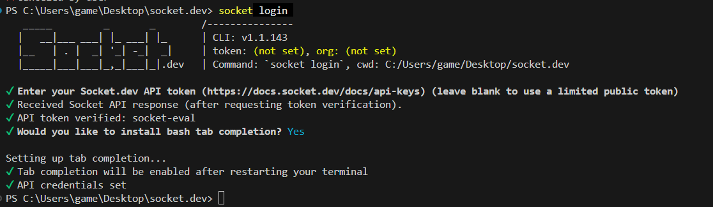

# Socket.dev Evaluation

## Setup

Install with socket.dev CLI

```
npm install -g socket
```

Verify installation using: `socket --version`
Result: `1.1.143` — installed successfully.

### Setup the token

Go to socket.dev and sign up.

After sign up, create an organization without GitHub (if you don't want to use the GitHub app).



After the organization is created, you'll be redirected to the main dashboard.



After that, click on the org name, go to Settings, and under Integrations go to API Tokens, then create a new API token.



You'll have the following access (scope) options for that API token.



For experimentation purposes, you can select all scopes and proceed.

Copy the token value and save it in an environment file (`.env` — not committed to this repo).

Now authenticate the CLI using: `socket login`

It will ask for your token — paste it.

Setup is complete.



### Notes

- Note: `docs.socket.dev/docs/api-keys` (linked from the CLI prompt) currently 404s — use the
  main `socket.dev` dashboard instead to create tokens.
- The API token's quota shown on the token page (e.g. 500) is a per-token allocation, separate
  from the org's overall monthly plan quota (Free tier = 1,000 scans/month).

## Demo project

To generate real, comparable output from both `npm audit` and the Socket CLI, a throwaway
project was created at [`demo-project/`](demo-project/) with a deliberately mixed set of
dependencies — some with known CVEs, one (`node-sass`) that runs install/postinstall scripts,
and one modern clean package as a baseline:

```json
{
  "name": "socket-eval-demo",
  "version": "1.0.0",
  "private": true,
  "dependencies": {
    "lodash": "4.17.15",
    "minimist": "0.0.8",
    "request": "2.88.0",
    "node-sass": "4.14.1",
    "axios": "^1.6.0"
  }
}
```

A lockfile was generated without installing anything (`npm i --package-lock-only`), then
`npm audit` was run against it.

## npm audit — CVE-only baseline

`npm audit` cross-references dependencies (including transitive ones) against the public npm
advisory database. It only flags packages with a **known, published CVE** — it has no concept
of install scripts, obfuscated code, or behavioral red flags. This is the baseline Socket is
being compared against.

<details>
<summary>Full <code>npm audit</code> output (19 vulnerabilities found)</summary>

```
PS C:\Users\game\Desktop\socket.dev\demo-project> npm audit

# npm audit report

cross-spawn <6.0.6
Severity: high
Regular Expression Denial of Service (ReDoS) in cross-spawn - https://github.com/advisories/GHSA-3xgq-45jj-v275
fix available via `npm audit fix --force`
Will install node-sass@9.0.0, which is a breaking change
node_modules/cross-spawn
node-sass >=1.2.0
Depends on vulnerable versions of cross-spawn
Depends on vulnerable versions of gaze
Depends on vulnerable versions of meow
Depends on vulnerable versions of node-gyp
Depends on vulnerable versions of request
Depends on vulnerable versions of sass-graph
node_modules/node-sass

form-data <=2.5.5
Severity: critical
form-data uses unsafe random function in form-data for choosing boundary - https://github.com/advisories/GHSA-fjxv-7rqg-78g4
form-data: CRLF injection in form-data via unescaped multipart field names and filenames - https://github.com/advisories/GHSA-hmw2-7cc7-3qxx
fix available via `npm audit fix --force`
Will install node-sass@9.0.0, which is a breaking change
node_modules/request/node_modules/form-data
request \*
Depends on vulnerable versions of form-data
Depends on vulnerable versions of qs
Depends on vulnerable versions of tough-cookie
Depends on vulnerable versions of uuid
node_modules/request
node-gyp <=10.3.1
Depends on vulnerable versions of request
Depends on vulnerable versions of semver
Depends on vulnerable versions of tar
node_modules/node-gyp

lodash <=4.17.23
Severity: high
Command Injection in lodash - https://github.com/advisories/GHSA-35jh-r3h4-6jhm
Prototype Pollution in lodash - https://github.com/advisories/GHSA-p6mc-m468-83gw
Regular Expression Denial of Service (ReDoS) in lodash - https://github.com/advisories/GHSA-29mw-wpgm-hmr9
lodash vulnerable to Code Injection via `_.template` imports key names - https://github.com/advisories/GHSA-r5fr-rjxr-66jc
lodash vulnerable to Prototype Pollution via array path bypass in `_.unset` and `_.omit` - https://github.com/advisories/GHSA-f23m-r3pf-42rh
Lodash has Prototype Pollution Vulnerability in `_.unset` and `_.omit` functions - https://github.com/advisories/GHSA-xxjr-mmjv-4gpg
fix available via `npm audit fix --force`
Will install lodash@4.18.1, which is outside the stated dependency range
node_modules/lodash

minimatch <=3.1.3
Severity: high
minimatch has a ReDoS via repeated wildcards with non-matching literal in pattern - https://github.com/advisories/GHSA-3ppc-4f35-3m26
minimatch has ReDoS: matchOne() combinatorial backtracking via multiple non-adjacent GLOBSTAR segments - https://github.com/advisories/GHSA-7r86-cg39-jmmj
minimatch ReDoS: nested _() extglobs generate catastrophically backtracking regular expressions - https://github.com/advisories/GHSA-23c5-xmqv-rm74
fix available via `npm audit fix --force`
Will install node-sass@9.0.0, which is a breaking change
node_modules/globule/node_modules/minimatch
globule _
Depends on vulnerable versions of minimatch
node_modules/globule
gaze >=0.4.0
Depends on vulnerable versions of globule
node_modules/gaze

minimist <=0.2.3
Severity: critical
Prototype Pollution in minimist - https://github.com/advisories/GHSA-vh95-rmgr-6w4m
Prototype Pollution in minimist - https://github.com/advisories/GHSA-xvch-5gv4-984h
fix available via `npm audit fix --force`
Will install minimist@1.2.8, which is a breaking change
node_modules/minimist

qs <6.14.1
Severity: moderate
qs's arrayLimit bypass in its bracket notation allows DoS via memory exhaustion - https://github.com/advisories/GHSA-6rw7-vpxm-498p
fix available via `npm audit fix --force`
Will install node-sass@9.0.0, which is a breaking change
node_modules/qs

scss-tokenizer <=0.4.2
Severity: high
Regular expression denial of service in scss-tokenizer - https://github.com/advisories/GHSA-7mwh-4pqv-wmr8
fix available via `npm audit fix --force`
Will install node-sass@9.0.0, which is a breaking change
node_modules/scss-tokenizer
sass-graph 2.2.0 - 4.0.0
Depends on vulnerable versions of scss-tokenizer
node_modules/sass-graph

semver 2.0.0-alpha - 5.7.1
Severity: high
semver vulnerable to Regular Expression Denial of Service - https://github.com/advisories/GHSA-c2qf-rxjj-qqgw
fix available via `npm audit fix --force`
Will install node-sass@9.0.0, which is a breaking change
node_modules/semver

tar <=7.5.15
Severity: high
Arbitrary File Creation/Overwrite due to insufficient absolute path sanitization - https://github.com/advisories/GHSA-3jfq-g458-7qm9
Arbitrary File Creation/Overwrite on Windows via insufficient relative path sanitization - https://github.com/advisories/GHSA-5955-9wpr-37jh
Denial of service while parsing a tar file due to lack of folders count validation - https://github.com/advisories/GHSA-f5x3-32g6-xq36
node-tar Vulnerable to Arbitrary File Creation/Overwrite via Hardlink Path Traversal - https://github.com/advisories/GHSA-34x7-hfp2-rc4v
node-tar is Vulnerable to Arbitrary File Overwrite and Symlink Poisoning via Insufficient Path Sanitization - https://github.com/advisories/GHSA-8qq5-rm4j-mr97
Arbitrary File Read/Write via Hardlink Target Escape Through Symlink Chain in node-tar Extraction - https://github.com/advisories/GHSA-83g3-92jg-28cx
tar has Hardlink Path Traversal via Drive-Relative Linkpath - https://github.com/advisories/GHSA-qffp-2rhf-9h96
node-tar Symlink Path Traversal via Drive-Relative Linkpath - https://github.com/advisories/GHSA-9ppj-qmqm-q256
Race Condition in node-tar Path Reservations via Unicode Ligature Collisions on macOS APFS - https://github.com/advisories/GHSA-r6q2-hw4h-h46w
node-tar applies PAX size override to intermediary GNU long-name/long-link headers, causing tar parser interpretation differential (file smuggling) - https://github.com/advisories/GHSA-vmf3-w455-68vh
fix available via `npm audit fix --force`
Will install node-sass@9.0.0, which is a breaking change
node_modules/tar

tough-cookie <4.1.3
Severity: moderate
tough-cookie Prototype Pollution vulnerability - https://github.com/advisories/GHSA-72xf-g2v4-qvf3
fix available via `npm audit fix --force`
Will install node-sass@9.0.0, which is a breaking change
node_modules/tough-cookie

trim-newlines <3.0.1
Severity: high
Uncontrolled Resource Consumption in trim-newlines - https://github.com/advisories/GHSA-7p7h-4mm5-852v
fix available via `npm audit fix --force`
Will install node-sass@9.0.0, which is a breaking change
node_modules/trim-newlines
meow 3.4.0 - 5.0.0
Depends on vulnerable versions of trim-newlines
node_modules/meow

uuid <11.1.1
Severity: moderate
uuid: Missing buffer bounds check in v3/v5/v6 when buf is provided - https://github.com/advisories/GHSA-w5hq-g745-h8pq
fix available via `npm audit fix --force`
Will install node-sass@9.0.0, which is a breaking change
node_modules/uuid

19 vulnerabilities (3 moderate, 13 high, 3 critical)

To address all issues (including breaking changes), run:
npm audit fix --force
```

</details>

**What this shows:** every finding here is a *known, published* CVE on a specific version
range. Nothing here relates to install scripts, package behavior, or maintainer/publish
anomalies — that's the gap the Socket CLI scan (next section) is meant to fill.
